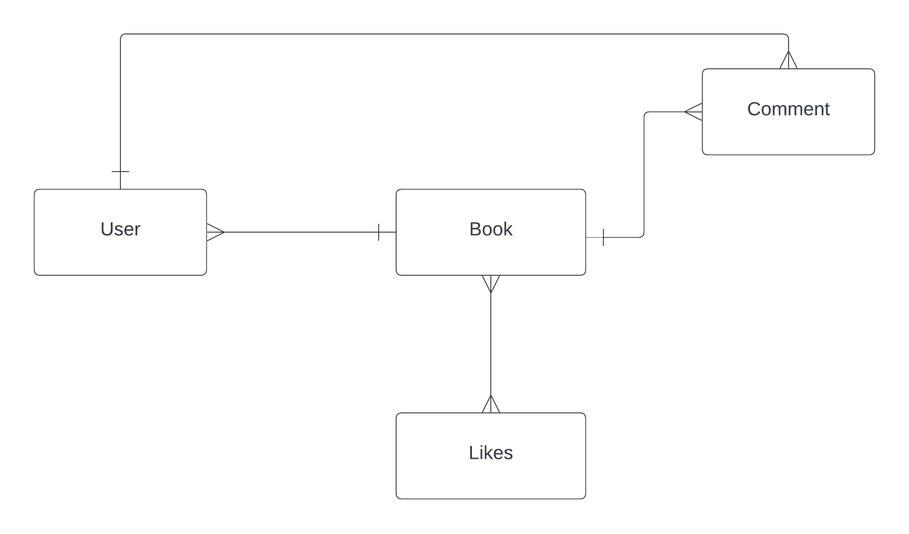

# Introduction
This web is a a chance for people who love books to share their favorites. The idea is not for people to create an extensive catalog of their library (although they may). Rather, it is for people to share from one to fifteen books from their shelf and have others be able to see and comment on what they read. There are 
many sites such as Goodreads where book lovers can discuss books. However, the website is rather slow, the search is poor, and the user interface is rather 
clunky. 

This site will allow people to sign in, share the books that they're interested in (called a shelf), and see what other people are reading. Users can comment
on books and like them. The whole idea is to get inspiration from other readers as to what books are out there.

## User Stories

As a adminstrator, I can login with privileges so that moderate all content on the site.
As a new user, I can create an account with a user name and password, so that I can log in to access content.
As a user, I can login with a user name and password, so that I can access the content of the site.


As a user, I can see a list of books so that I can get inspiration as to what I want to read next. 
As a user, I can add a book from a form so that I can share my recommendation with other users. 
As a user, I can delete a book from list so that I can keep my recommendations current and germane. 

As a user, I can modify a book so that I can correct mistakes or improve content.
As a user, I can comment on a book so that I can share my opinion about the book with the community.
As a user, I can like or unlike a book so that other users can make a decision to read a book based on popularity.

As a user, I can only modify or delete my own entries so that others may not tamper with my recommendations.

As a user, I can receive feedback when I interact with the site so that I know if my actions are successful.

As a user, I can see a list of books so that I can get inspiration as to what I want to read next.
As a user, I can see a list of my liked books so that I can keep track of books I am really interested in.
As a user, I can see a list of books that I have added so I can better manage the content I contribute.

# UX Design

# Database Design
## Classes
The **User** class is the default User class from Django.

The **Book** class is the key custom class in this project as the main function of the site is for users to share their book recommendations. The genres are generated from a predefined list of choices. This is for consistency - ie we do not want users to each define their own genre.

|Book ||
|-----|----|
|type|field name|
|CharField|title|
|SlugField|slug|
|CharField|author|
|TextField|description|
|ForeignKey User|owner|
|CharField|genre|
|ManyToManyField User|likes|

The **Comment** class is used to represent a block of text that a user creates and is attached to a book. A **Book** can have many **Comment**s but each **Comment** can only belong to one **Book**. Each **Comment** can have only one **User** author, but each **User** author can write many **Comment**s.
|Comment ||
|-----|----|
|type|field name|
|ForegnKey User|author|
|ForegnKey Book|book|
|TextField|body|
|DateTimeField|written_on|

## Database Relationships
The following Entity Relationship Diagram shows how the models are related to each other
+ User-Book is one-to-many because a User can have many Books but each Book can belong to onyl one User
+ Book-Liks is many-to-many because a Book can have have likes from many users and a User can like many Books
+ Book-Comment is one-to-many because a Book can have many Comments but each Comment can belong to only one Book
+ Comment-User is one-to-many because a User can have many Comments but each Comment can belong to only one User.



# Agile Workflow


# Features

## Admin Panel
There is an admin panel which users with the correct privilefes (superusers), can see and manipulate all of the data in the site.
> As a adminstrator, I can login with privileges so that moderate all content on the site.

## allauth authentication
When the user navigates to the site, they are given a chance to login if they already have an account and to sign up if they do not.
After successful account creation or login attempt, they are taken to the home screen. If they log out, they are taken back to the login screen.
> As a new user, I can create an account with a user name and password, so that I can log in to access content.  
> As a user, I can login with a user name and password, so that I can access the content of the site.

## Home Page
On the home page, a logged in user will see a list of all the books in the database. 
> As a user, I can see a list of books so that I can get inspiration as to what I want to read next.

## Favorites
This is the list of books that the user has liked. This is so that they can keep track of the books that they have liked and should serve as 
a list of what they might be interested in reading.
> As a user, I can see a list of my liked books so that I can keep track of books I am really interested in.


## My Books
This is a list of the books that the user has posted themselves. This is so that the user can best manage the content that they have created.
> As a user, I can see a list of books that I have added so I can better manage the content I contribute.


## Add a Book
In the nav bar, the user can see an Add Book link if they are logged in. They are taken to a form where they can enter the details for
a new book.
> As a user, I can add a book from a form so that I can share my recommendation with other users. 

## Delete a Book
Next to each book is a link for the user to delete a book. Upon clicking, the book is deleted and the user is redirected to the home page. The user will only see link to delete a book if they are the owner of the book - they are the one that submitted it.
> As a user, I can delete a book from list so that I can keep my recommendations current and germane. 
> As a user, I can only modify or delete my own entries so that others may not tamper with my recommendations.

## Modify a Book Entry
With each book is a link to edit the book. Here, the user is taken to a form field pre-populated with the book's details. They can change the fields
as they like. When they press update, the new details are updated in the database and the user is taken back to the home page. The user will only see a link
to edit a book if they are the owner of that book - they are the one that submitted it.
> As a user, I can modify a book so that I can correct mistakes or improve content.
> As a user, I can only modify or delete my own entries so that others may not tamper with my recommendations.

## Leaving a Comment
When the user clicks on the View Comments link, they are taken to a page where all of the books comments are displayed. And a form is given
for the user to enter their own comment. Upon clicking on the submit button, the comment is saved to the database and the new comment is 
reflected in the list.
> As a user, I can comment on a book so that I can share my opinion about the book with the community.

## Liking a Book
For each book, there is an icon for the user to like the book. If the user has already liked the book, the icon is filled. Otherwise it
is empty. The total likes are displayed next to the icon. When the user clicks on the like icon, the status toggles - like goes to unlike
and vice versa. 
> As a user, I can like or unlike a book so that other users can make a decision to read a book based on popularity.

## Alerts
When the user has successfully interacted with the site - signing in or out, creating an account,  adding a book entry, updating a book entry, adding a comment or a like, the user is alerted.
Upon success, a green alert message undeneath the navbar appears letting the user know they have successfully interacted with the site.

> As a user, I can recieve feedback when I interact with the site so that I know if my actions are successful or not and why.  

# Testing
The testing done here is BDD testing.
## Initial Setup Testing
| Test Description              | Test | Result |
|-------------------------------|------------------------------------------|--------|
|Test djano installation| When I run the danjo server, <br> and open the webrowser with the address, <br> the default django landing page is shown| PASS|
|Test basic routing|When I run the server <br> and enter the hello/ endpoint <br> "Hello world" is displayed| PASS|
|Test static template| When I run the server <br>  and enter hello-template/ as the endpoint <br> I see the contents of hello_template.html displayed|PASS|
|Test static css loaded|When I run the server <br>  and enter hello-template/ as the endpoint <br> I see the contents of hello_template.html displayed with blanchedalmond background color and h1 as blue font |PASS|
|Test admin site login|When I run the server <br> and enter /admin as the endpoint <br>  and login with admin username and password <br>  the default django admin page is loaded| PASS|
|Test Heroku deployment|After deploying to Heroku <br> and loading the /hello and /hello-template/ endoints <br> The site content displayed is identical to the local version| PASS|
|Heroku admin login|When I navigate to the /admin endpoint in heroku, <br> and login with admin username <br> The admin panel is loaded| PASS|
|Admin Heroku Deployment|When I navigate to the /admin endpoint in heroku, <br> and login with admin username <br> The admin panel looks identical to the local version |FAIL The site loads but there is no styling|

## Model Creation Tests
| Test Description              | Test | Result |
|-------------------------------|------------------------------------------|--------|
|Model tables in Admin Panel|When I log into the admin panel as a superuser <br> I can see tables for Users, Book|PASS|

## User Login Tests
| Test Description              | Test | Result |
|-------------------------------|------------------------------------------|--------|
|allauth installation|When I enter accounts/signup as the url in the site <br> I am taken to the allauth signup screen|PASS|
|allauth user  creation|When I go the signup screen, and enter a user name and password, and press signup , my account is created and I am redirected to home screen| PASS|
|user creation verification|When I login to the admin panel, the new user is visible in the user table.| PASS|
|content display after login|When I login successfully, the homepage is displayed|PASS|
|redirect if not authenticated|When I navigate to the site <br> and I am not authenticated <br> I am taken to the login screen| PASS|
|redirect after sign up|When I successfully create an account <br> The site content is displayed| PASS|
|redirect after logout|Wheb I successfully logout <br> I am taken to the login screen|PASS|

## CRUD for Book Objects Tests
| Test Description              | Test | Result |
|-------------------------------|------------------------------------------|--------|
|list of books displayed on homepage|As a logged in user <br> when I am on the home screen <br> all of the books in the database are displayed|PASS|
|add book form|As a logged in user <br> when i click on Add Book link <br> and fill in fields and submit forms <br> The added book shows up in the list on the home page. |PASS|
|delete book link |As a logged in user <br> when I click on the delete book link <br> the book is removed from the list| PASS |
|list of comments is displayed| As a logged in user <br> when I click on View Comments <br> I am taken to the details page where book details and comments displayed.| PASS|
|update book link navigation|As a logged in user <br> when I click on the edit book link <br> A page with a form pre-populated with the book's details is displayed|PASS|
|updated data submission|As a logged in user <br> When I press the "Update Book" button on the edit page <br> I am taken to the home page and the updated fields are reflected in the list.|PASS|
|Add a comment|As a logged in user <br> when I have entered a comment <br> and press submit <br> my comment is saved and is displayed in the list comments|PASS|
|Delete/modify own content|As a logged in user <br> when I am on the home page <br> I see links to edit / delete books only for entries I have submitted| PASS|
|My Books Page|As a logged in user <br> when I navigate to the My Books page <br> I see a list of only the books that I have added. |PASS|
|Favorites Page|As a logged in user <br> when I navigate to the Favorites page <br> I see a list of the books that I have liked| PASS|


## User Likes
| Test Description              | Test | Result |
|-------------------------------|------------------------------------------|--------|
|Total likes displayed|As a logged in user <br> the total likes for each book is displayed| PASS|
|Link to unlike| As logged in user <br> If I have liked a book, a link to unlike the book is displayed | PASS|
|Link to like|As logged in user <br> If I have not liked a book, a link to like the book is displayed| PASS|

## Alerts 
| Test Description              | Test | Result |
|-------------------------------|------------------------------------------|--------|
|Successully add book alert| As a logged in user <br> When I successfully add a book <br> An alert is shown under the nav bar telling me. |PASS|
|Successully edit book alert|As a logged in user <br> When I successfully edit a book <br> An alert is shown under the nav bar telling me.|PASS|
|Successully add comment alert|As a logged in user <br> When I successfully add a comment <br> An alert is shown under the nav bar telling me.|PASS|
|Successully sign in alert|As a logged in user <br> When I successfully sign in <br> An alert is shown under the nav bar telling me.|PASS|
|Successully sign out alert|As a logged in user <br> When I successfully sign out <br> An alert is shown under the nav bar telling me.|PASS|
|Successully create account alert|As a logged in user <br> When I successfully create an account <br> An alert is shown under the nav bar telling me.|PASS|
|Alert auto dismiss|After the alert is shown <br> The alert dismisses itslef.|PASS|

# Deployment

## technology used

gunicorn - server to run django on heroku
dj-database-url Use Database URLs in your Django Application.
dj3-cloudinary-storage - Allows use of cloudinary
crispy-forms
bootstrap 5


## Project Creation
+ Cloned CI Repository
+ Initalized GitPod Workspace
+ Installed support libraries
    + django
    + gunicorn
    + dj-database-url
    + dj3-cloudinary storage
+ created requirements.txt
+ Create django project
```
django-admin startproject bookshelf .
```
+ create shelf app and add it to settings.py
+ migrate changes

## Deployment to Heroku
+ Create heroku app
+ setup ElephantSQL Account
+ create env.py
    + import os
    + entry for database URL
    + entry for secret key
+ update settings.py to connect to new database
+ run migrations again
+ check connection though table query in ElephantSQL dashboard
+ go to heroku dashboard for app
    + click settings
    + add three config vars: DATABASE_URL, SECRET_KEY, and PORT
+ setup cloudinary account (just in case)
+ add CLOUDINARY_URL as os.environ to settings.py
+ add CLOUDINARY_URL as config var to heroku
+ add cloudinary apps to settings.py in INSTALLED_APPS
+ set static file storage variables
+ add template variables
+ create media, static, and templates directories
+ add Procfile
+ connect to github respository
    + deploy from branch


# Credits

The idea and code for using the Bootstrap modals and django messages was from this YouTube video by [DjangoMastery](https://www.youtube.com/watch?v=zbsY-4ZLSkI).