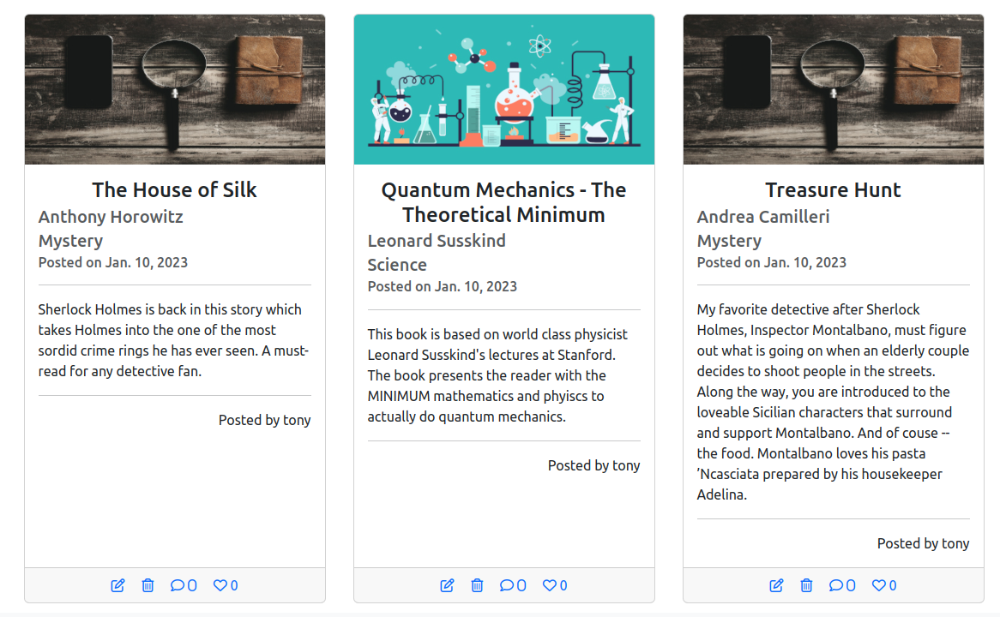
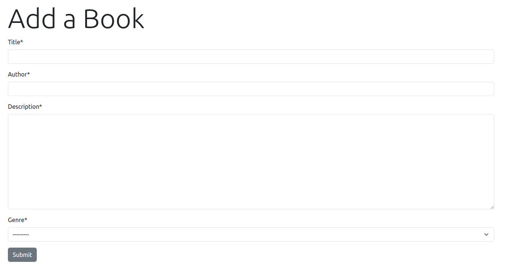

- [Introduction](#introduction)
  * [User Stories](#user-stories)
- [Database Design](#database-design)
  * [Classes](#classes)
  * [Database Relationships](#database-relationships)
- [Agile Workflow](#agile-workflow)
  * [Adding essential features first.](#adding-essential-features-first)
  * [GitHub Features](#github-features)
    + [Issues](#issues)
    + [Projects](#projects)
- [Features](#features)
  * [Admin Panel](#admin-panel)
  * [allauth authentication](#allauth-authentication)
  * [Home Page](#home-page)
    + [Book Card](#book-card)
  * [Favorites](#favorites)
  * [My Books](#my-books)
  * [Add a Book](#add-a-book)
  * [Delete a Book](#delete-a-book)
  * [Modify a Book Entry](#modify-a-book-entry)
  * [Leaving a Comment](#leaving-a-comment)
  * [Liking a Book](#liking-a-book)
  * [Alerts](#alerts)
  * [Filter and Search](#filter-and-search)
    + [Filter by User](#filter-by-user)
    + [Filter by Genre](#filter-by-genre)
    + [Search by Author, Title, Description](#search-by-author--title--description)
    + [No Results Found](#no-results-found)
    + [404](#404)
- [Testing](#testing)
  * [Initial Setup Testing](#initial-setup-testing)
  * [Model Creation Tests](#model-creation-tests)
  * [User Login Tests](#user-login-tests)
  * [CRUD for Book Objects Tests](#crud-for-book-objects-tests)
  * [User Likes](#user-likes)
  * [Alerts](#alerts-1)
  * [Search and Filtering Tests](#search-and-filtering-tests)
- [Version Control Strategy](#version-control-strategy)
- [Deployment](#deployment)
  * [technology used](#technology-used)
  * [Project Creation](#project-creation)
  * [Deployment to Heroku](#deployment-to-heroku)
- [Credits](#credits)
  * [Page Image Credits](#page-image-credits)
  * [Book Genre Image Credits](#book-genre-image-credits)

# Introduction
This web is a a chance for people who love books to share their favorites. The idea is not for people to create an extensive catalog of their library (although they may). Rather, it is for people to share one or several books from their shelf and have others see, comment on, or like what the books they have posted. 

This site will allow people to sign in, share the books that they're interested in, and see what other people are reading. Users can comment
on books and like them. The whole idea is to get inspiration from other readers as to what books are out there and to share one's love of the printed word with similarly minded people.

## User Stories

+ As a administrator, I can login with privileges so that moderate all content on the site.
+ As a new user, I can create an account with a user name and password, so that I can log in to access content.
+ As a user, I can login with a user name and password, so that I can access the content of the site.


+ As a user, I can see a list of books so that I can get inspiration as to what I want to read next. 
+ As a user, I can add a book from a form so that I can share my recommendation with other users. 
+ As a user, I can delete a book from list so that I can keep my recommendations current and germane. 

+ As a user, I can modify a book so that I can correct mistakes or improve content.
+ As a user, I can comment on a book so that I can share my opinion about the book with the community.
+ As a user, I can delete a comment that I have made so that I can remove content that I no longer wish others to see.
+ As a user, I can edit my own comments so that I have the ability to correct a mistake I have made.

+ As a user, I can like or unlike a book so that other users can make a decision to read a book based on popularity.

+ As a user, I can only modify or delete my own entries so that others may not tamper with my recommendations.

+ As a user, I can receive feedback when I interact with the site so that I know if my actions are successful.

+ As a user, I can see a list of books so that I can get inspiration as to what I want to read next.
+ As a user, I can see a list of my liked books so that I can keep track of books I am really interested in.
+ As a user, I can see a list of books that I have added so I can better manage the content I contribute.

+ As a user, I can see the relevant information for a book entry in an organized, visually appealing format.
+ As a user, I can see a image for book based on genre so that it is visually easier to find books of the genre I am interested in.

+ As a user, I can filter posts by contributor so that I can better find content that is relevant to me.
+ As a user, I can filter posts by genre so that I can better find content that is relevant to me.
+ As a user, I can search for posts so that I can better find books to suit my interests.

+ As a user, I can interact with content that is paginated so that I can more easily consume large lists of content.

# Database Design
## Classes
The **User** class is the default User class from Django.

The **Book** class is the key custom class in this project as the main function of the site is for users to share their book recommendations. The genres are generated from a predefined list of choices. This is for consistency - ie we do not want users to each define their own genre.

|Book ||
|-----|----|
|type|field name|
|CharField|title|
|SlugField|slug|
|CharField|author|
|TextField|description|
|ForeignKey User|owner|
|CharField|genre|
|ManyToManyField User|likes|
|URLField|image_url|
|DateField|posted_on|

The **Comment** class is used to represent a block of text that a user creates and is attached to a book. A **Book** can have many **Comment**s but each **Comment** can only belong to one **Book**. Each **Comment** can have only one **User** author, but each **User** author can write many **Comment**s.
|Comment ||
|-----|----|
|type|field name|
|ForeignKey User|author|
|ForeignKey Book|book|
|TextField|body|
|DateTimeField|written_on|

## Database Relationships
The following Entity Relationship Diagram shows how the models are related to each other
+ User-Book is one-to-many because a User can have many Books but each Book can belong to only one User
+ Book-Like is many-to-many because a Book can have have likes from many users and a User ca  n like many Books
+ Book-Comment is one-to-many because a Book can have many Comments but each Comment can belong to only one Book
+ Comment-User is one-to-many because a User can have many Comments but each Comment can belong to only one User.


# Agile Workflow
An approximation of the agile workflow was used in the development of this project. The key ideas adopted were:
+ focus on the essential features first
+ work in small iterations
+ add extra features as time permitted
+ using GitHub's kanban board, issues, labels, and project features to organize these iterations.

## Adding essential features first.
For example, in this project, a minimally functioning backend was built first. No consideration was given to styling the output or templates.
A sketch of how the site was built is as follows:
+ the simplest authentication with allauth - username and password
+ creating the simplest database models and relationships that would give a minimally functioning product. This included:
    + adding a book with basic info: title, author, description, genre
    + deleting a book (only books the user themselves posted)
    + leaving a comment
    + loading books and displaying them
Search and filter would be added later.
+ Once these features were implemented, a minimum front-end was built. Attention was first paid to basic styling and layout with Bootstrap
    + Adding a navbar and footer
    + Adding responsive layout to the login, logout, and sign up pages, and comment form
    + Displaying the essential information of a book in a Bootstrap card
    + Placing those cards in responsive rows and columns.
    + Adding links to add comments and likes

In subsequent iterations, extra features such as basic search and filtering were added. This included:
+ MyBooks - Only the users own books are displayed
+ MyFavorites - All of the books the user liked are displayed
+ Once these features were styled and functioning properly, imagery was added to the site. This included adding images representing each genre to the Book class. 
+ Finally, searching based on genre, title, author and description was added using a modal search form.


## GitHub Features
GitHub's project management features were used to organize, prioritize, and document the build process.
### Issues
Each larger scale task was given a GitHub issue. This included the user stories, and anything else that would require attention. Issues were assigned labels to help prioritize them in the work flow. As can be seen, some issues are marked as "Must Do" while others are marked as "Should Do". Some issues are enhancements, others are questions requiring research. Often, if I ran into a problem that was not critical to fix (an ugly margin for example) or if I thought of a feature that I would like to add, I created an issue and assigned it a label to help me keep track of how important it is. The key is that essential features and critical issues were fixed first.


### Projects
Issues often are related to each other - this includes user stories and additional features. For example, user stories around CRUD operations belong together as well as issues involved with search and styling. To help keep issues organized, those that are related to each other were organized into projects.

For example, one can see here that there are projects based on CRUD, django setup, etc. (These projects are closed. At the time of this writing, there is still an open project for styling.) Within each project, the related issues are organized into a kanban board. In the following example, one can see the user story issues displayed in the Done column. 

Of course, not every task in the board is an issue. The reason is that each issue often requires several steps to achieve. Therefore, under each issue, I would plan the steps to solve each issue. This was for two reasons:
 1. It helped break the task down into smaller chunks which helped me organize my workday productively - I was able to dedicate time and effort to completing each task rather than planning over and over again.
 2. It is very satisfying to move tasks from the ToDo, to Doing to Done. It gives me a sense of accomplishment - even if the issue is not entirely solved, progress was made in its resolution.


# Features

## Admin Panel
There is an admin panel which users with the correct privileges (superusers), can see and manipulate all of the data in the site.
> As a administrator, I can login with privileges so that moderate all content on the site.

## allauth authentication
When the user navigates to the site, they are given a chance to login if they already have an account and to sign up if they do not.
After successful account creation or login attempt, they are taken to the home screen. If they log out, they are taken back to the login screen.
> The login screen:  
>   
> When the user logs out, they are asked to confirm their choice.  
>   
> This is the account creation screen when the user clicks Sign Up  
> 


> As a new user, I can create an account with a user name and password, so that I can log in to access content.  
> As a user, I can login with a user name and password, so that I can access the content of the site.

## Home Page
On the home page, a logged in user will see a list of all the books in the database. The content on this page is paginated, since it will have the most content on it and users will be very frustrated dealing with large lists of content. This is the only page that has paginated content since the others (the user's own books, likes, and search results) will most likely have enough limitation in result size that pagination is not necessary.

 
> As a user, I can see a list of books so that I can get inspiration as to what I want to read next.  
> As a user, I can interact with content that is paginated so that I can more easily consume large lists of content.  

### Book Card
Each book entry is displayed as a Bootstrap card. In addition to the Title, Author, Description and Genre, each book card has an image that corresponds to the genre of the book. In addition, at the footer of each card is an icon bar where the user can view the comments, like the book, or (if they are the owner of the book) can edit or delete it.


> As a user, I can see the relevant information for a book entry in an organized, visually appealing format.  
> As a user, I can see a image for book based on genre so that it is visually easier to find books of the genre I am interested in.  

## Favorites
This is the list of books that the user has liked. This is so that they can keep track of the books that they have liked and should serve as 
a list of what they might be interested in reading.

> As a user, I can see a list of my liked books so that I can keep track of books I am really interested in.

## My Books
This is a list of the books that the user has posted themselves. This is so that the user can best manage the content that they have created.
> As a user, I can see a list of books that I have added so I can better manage the content I contribute.


## Add a Book
In the nav bar, the user can see an Add Book link if they are logged in. They are taken to a form where they can enter the details for
a new book.

> As a user, I can add a book from a form so that I can share my recommendation with other users. 

## Delete a Book
Next to each book is a link for the user to delete a book. Upon clicking, the book is deleted and the user is redirected to the home page. The user will only see link to delete a book if they are the owner of the book - they are the one that submitted it.
> This is the card footer when the user is the owner of the book.    
and this
> is the footers when the user is NOT the owner of the book. 
> So the user can only delete (or edit) a book that they own.  
> As a user, I can delete a book from list so that I can keep my recommendations current and germane. 
> As a user, I can only modify or delete my own entries so that others may not tamper with my recommendations.

## Modify a Book Entry
With each book is a link to edit the book. Here, the user is taken to a form field pre-populated with the book's details. They can change the fields
as they like. When they press update, the new details are updated in the database and the user is taken back to the home page. The user will only see a link
to edit a book if they are the owner of that book - they are the one that submitted it.
  
> As a user, I can modify a book so that I can correct mistakes or improve content.
> As a user, I can only modify or delete my own entries so that others may not tamper with my recommendations.

## Leaving a Comment
When the user clicks on the View Comments link, they are taken to a page where all of the books comments are displayed. And a form is given
for the user to enter their own comment. Upon clicking on the submit button, the comment is saved to the database and the new comment is 
reflected in the list. For only the comments that have been written, two icons appear. One allows them to edit the comment and the other allows them to delete the comment. The user is prompted with a confirmation dialog when they click on the delete comment button. When the user clicks on the edit comment button, a modal form appears populated with the user's comment. If they submit, the comment is updated, if not the modal is dismissed.

> As a user, I can comment on a book so that I can share my opinion about the book with the community.  
> As a user, I can delete a comment that I have made so that I can remove content that I no longer wish others to see.  

## Liking a Book
For each book, there is an icon for the user to like the book. If the user has already liked the book, the icon is filled. Otherwise it
is empty. The total likes are displayed next to the icon. When the user clicks on the like icon, the status toggles - like goes to unlike
and vice versa. 
  
> As a user, I can like or unlike a book so that other users can make a decision to read a book based on popularity.

## Alerts
When the user has successfully interacted with the site - signing in or out, creating an account,  adding a book entry, updating a book entry, adding a comment or a like, the user is alerted.
Upon success, a green alert message underneath the navbar appears letting the user know they have successfully interacted with the site. The following is an example to let the user know their comment has been successfully added.

> As a user, I can receive feedback when I interact with the site so that I know if my actions are successful or not and why.  

## Filter and Search
### Filter by User
In each book post, there is a line stating the user that posted that book. For all other users (ie, users that are not the logged in user), their name 
appears as a link. When clicked, a list of all the posts by that user are shown. 

> As a user, I can filter posts so that I can better find content that is relevant to me. 

### Filter by Genre
When the user clicks on the magnifying glass icon in the upper right corner, a modal search form is displayed. In the form are the check-boxes that correspond to each of the genres in the database. The user can select one, several, (or none) to filter by. When the user clicks the Search button, only those books whose genres match the selected ones are displayed. The search is an OR search - since that is what a user would expect. If they select 'Mysteries', 'Cookbooks',  and 'Biographies' they expect to get books in any of these genres not books that have all three.

> As a user, I can filter posts by genre so that I can better find content that is relevant to me.  

### Search by Author, Title, Description
When the user clicks on the magnifying glass icon in the upper right corner, a modal search form is displayed. In addition to the check boxes corresponding to the genres, there are three text input fields for Title, Author, and Description. These are all optional. The database will queries the fields based on the words entered. The search is an AND search, since that is how the user would expect the database to behave. For example, if they enter "Ray Bradbury" for the author and "gripping and exciting", they mean books by Ray Bradbury that are also described as being gripping and exciting.
> For example, the following books were returned after entering 'Sicilian' and 'Holmes' in the description of the form. The books have Holmes OR Sicilian in the description.  
> 
> As a user, I can search for posts so that I can better find books to suit my interests.  

### No Results Found
If the results are empty, then the user is shown a message with a graphic telling them nothing has been found.
  
> As a user, I can receive feedback when I interact with the site so that I know if my actions are successful.

### 404 
If the user decides to type random endpoints, they will be served the following 404 page with a large button offering them to be taken to the home screen.


# Testing
The testing done here is BDD testing. To reduce the length of the readme, here is a link to the [testing tables](test_cases.md) describing the various test cases.

# Version Control Strategy
Git was employed in this project and the project code hosted on GitHub. I used branches in order to keep the main branch as "pure" as possible. The strategy was to have each branch dedicated to one feature or fix. Once I was satisfied at a particular stage of a branch, I would navigate to GitHub, click on my repository, select the branch, and create a pull request. GitHub would then check if there are no conflicts and indicate if the branch could be merged into main. (One can choose which branch to merge into.) Once the pull request is created, I navigated down, wrote a comment, and clicked on the green Merge button and the commits would be merged into the main branch. I tried to keep commits as atomic as possible - focusing only on one element or feature at a time. This was not always the case, but most of the commits are relatively small changes. In addition, I tried not to mix features in a branch. Small tweaks to other features were allowed, but the majority of the work on each branch was dedicated to that one feature. This is in line with the agile method of tackling a project - the team (in this case me) should only work on one feature at a time. 

> The following screenshot shows some of the git branches in the project. Each branch is clearly labelled and is dedicated to one feature.  
> 

# Deployment
## Technology used
+ [gunicorn](https://gunicorn.org/) - Server to run django on heroku
+ [dj-database-url](https://pypi.org/project/dj-database-url/) - Use Database URLs in your Django Application.
+ [dj3-cloudinary-storage](https://pypi.org/project/dj3-cloudinary-storage/) - Allows use of Cloudinary storage to serve static files and media. This is important since django is not really designed to serve static files itself.
+ [Cloudinary](https://cloudinary.com/) - Media cloud storage service to serve static files
+ [ElephantSQL](https://www.elephantsql.com/) - An online service running a PostgreSQL server as a service.
+ [crispy-forms](https://django-crispy-forms.readthedocs.io/en/latest/) - A package to help automatically style django forms
+ [Bootstrap 5](https://getbootstrap.com/) - A CSS/JavaScript library to make responsive websites.

## Project Creation
+ Cloned CI Repository
+ Initialized GitPod Workspace
+ Installed support libraries
    + django
    + gunicorn
    + dj-database-url
    + dj3-cloudinary storage
+ created requirements.txt
+ Create django project
```
django-admin startproject bookshelf .
```
+ create shelf app and add it to settings.py
+ migrate changes

## Deployment to Heroku
+ Create heroku app
+ setup ElephantSQL Account
+ create env.py
    + import os
    + entry for database URL
    + entry for secret key
+ update settings.py to connect to new database
+ run migrations again
+ check connection though table query in ElephantSQL dashboard
+ go to heroku dashboard for app
    + click settings
    + add three config vars: DATABASE_URL, SECRET_KEY, and PORT
+ setup cloudinary account (just in case)
+ add CLOUDINARY_URL as os.environ to settings.py
+ add CLOUDINARY_URL as config var to heroku
+ add cloudinary apps to settings.py in INSTALLED_APPS
+ set static file storage variables
+ add template variables
+ create media, static, and templates directories
+ add Procfile
+ connect to github repository
    + deploy from branch
+ before final deployment, the debug setting was set to false for security
+ before final deployment, the DISABLE_COLLECTSTATIC config var in Heroku was removed

# Credits

The idea and code for using the Bootstrap modals and django messages was from this YouTube video by [DjangoMastery](https://www.youtube.com/watch?v=zbsY-4ZLSkI).

The HTML code for the Modals was taken from the [Bootstrap](https://getbootstrap.com/docs/5.2/components/modal/) website and modified accordingly. 

I used this tutorial on [SimpleIsBetterThanComplex](https://simpleisbetterthancomplex.com/) for the pagination feature using function based views: [How to Paginate with Django](https://simpleisbetterthancomplex.com/tutorial/2016/08/03/how-to-paginate-with-django.html)


The Table of Contents was created with <a href='http://ecotrust-canada.github.io/markdown-toc/'>markdown-toc</a>.

## Page Image Credits
+ The image on the Login screen was taken from [Pexels](https://www.pexels.com/) and was taken by [Pixabay](https://www.pexels.com/photo/pages-on-an-opened-book-415071/)
+ Library image is from <a href="https://www.freepik.com/free-vector/library-with-books-shelves-laptop-table_7743156.htm#query=empty%20shelf&position=8&from_view=search&track=sph">upklyak</a> on Freepik

+ Image for empty results <a href="https://www.freepik.com/free-vector/empty-concept-illustration_7117865.htm#query=no%20data&position=2&from_view=search&track=sph">Image by storyset</a> on Freepik
+ The image for on the Signup page was taken from [unDraw Illustrations](https://undraw.co/illustrations)
+ The question mark image was created by [Roundicons](https://www.flaticon.com/free-icons/question") and was downloaded from [flaticon](https://www.flaticon.com/)
+ The 404 error image was created by <a href="https://www.freepik.com/free-vector/internet-network-warning-404-error-page-file-found-web-page-internet-error-page-issue-found-network-404-error-present-by-man-sleep-display_21586054.htm#query=404%20page&position=3&from_view=search&track=sph">jcomp</a> on Freepik

## Book Genre Image Credits
+ Fantasy Book Cover Image: <a href="https://www.freepik.com/free-vector/black-spooky-castle-flying-dragon-canyon-with-mountains-forest-cartoon-fantasy-illustration-with-medieval-palace-with-towers-creepy-beast-with-wings-rocks-pine-trees_12207978.htm#query=fantasy&position=1&from_view=search&track=sph">Image by upklyak</a> on Freepik
+ Adventure Book Cover Image: <a href="https://www.freepik.com/free-vector/camping-place-cartoon-composition-with-yellow-tent-lamp-pot-with-dinner-fire-night-sky_13749110.htm#query=adventure&position=21&from_view=search&track=sph">Image by macrovector</a> on Freepik
+ Romance Book Cover Image: <a href="https://www.freepik.com/free-photo/paper-valentines-day-hearts-pink_3915611.htm#query=romance&position=41&from_view=search&track=sph">Image by valeria_aksakova</a> on Freepik
+ Mystery Book Cover Image: <a href="https://www.freepik.com/free-photo/mobile-smartphone-magnifier-notebook-with-leather-cover-isolated-black-farm-wooden-table_11333683.htm#query=mystery&position=27&from_view=search&track=sph">Image by bublikhaus</a> on Freepik
+ Horror Book Cover Image: <a href="https://www.freepik.com/free-vector/frightening-halloween-realistic-background_3824490.htm#query=horror&position=2&from_view=search&track=sph">Image by vectorpouch</a> on Freepik
+ Thriller Book Cover Image: <a href="https://www.freepik.com/free-vector/crime-scene-night-murder-place-dark-room_6823044.htm#query=thriller&position=3&from_view=search&track=sph">Image by vectorpouch</a> on Freepik

+ Science Fiction Book Cover Image: <a href="https://www.freepik.com/free-photo/alien-planet-building_14541108.htm#query=science%20fiction&position=10&from_view=search&track=sph">Image by liuzishan</a> on Freepik

+ Biography Book Cover Image: <a href="https://www.freepik.com/free-vector/social-biography-concept-illustration_12704426.htm#query=biography&position=45&from_view=search&track=sph">Image by storyset</a> on Freepik

+ Dystopia Book Cover Image: Photo by [cottonbro studio](https://www.pexels.com/photo/person-in-brown-coat-and-black-pants-standing-on-gray-concrete-floor-4888474/)

+ Cookbook Book Cover Image: <a href="https://www.freepik.com/free-vector/set-people-cooking-their-favourite-food_8247921.htm#query=cooking&position=0&from_view=search&track=sph">Image by pikisuperstar</a> on Freepik

+ Motivation Book Cover Image: <a href="https://www.freepik.com/free-photo/hikers-top_7630716.htm#query=motivation&position=3&from_view=search&track=sph">Image by wirestock</a> on Freepik

+ Health Book Cover Image: <a href="https://www.freepik.com/free-photo/doctors-hands-holding-medical-care-objects_18417027.htm#query=health&position=5&from_view=search&track=sph">Image by rawpixel.com</a> on Freepik

+ History Book Cover Image: [Pixabay](https://www.pexels.com/photo/stonehenge-under-nimbostratus-clouds-161798/)

+ Travel Book Cover Image: [Leah Kelley](https://www.pexels.com/photo/woman-looking-at-the-map-3935702/)

+ How-To Book Cover Image: [Thijs van der Weide](https://www.pexels.com/photo/man-holding-wooden-stick-while-drilling-hole-1094767/)

+ Historical Fiction Cover Image: [JJ Jordan](https://www.pexels.com/photo/focused-woman-in-old-outfit-reading-book-with-oil-lamp-4145059/)

+ Placeholder Cover Image: [Photo by Pixabay](https://www.pexels.com/photo/selective-focus-photography-of-white-softbound-book-267586/)

+ Science Book Cover Image: <a href="https://www.freepik.com/free-vector/science-laboratory-composition_21078541.htm#query=science&position=17&from_view=search&track=sph">Image by macrovector</a> on Freepik

+ Maths Book Cover Image: <a href="https://www.freepik.com/free-vector/math-background_4365871.htm#query=mathematics&position=13&from_view=search&track=sph">Freepik</a>

+ Comments Image: Image by <a href="https://www.freepik.com/free-vector/reviews-concept-landing-page_5168344.htm#query=comments&position=20&from_view=search&track=sph">Freepik</a>